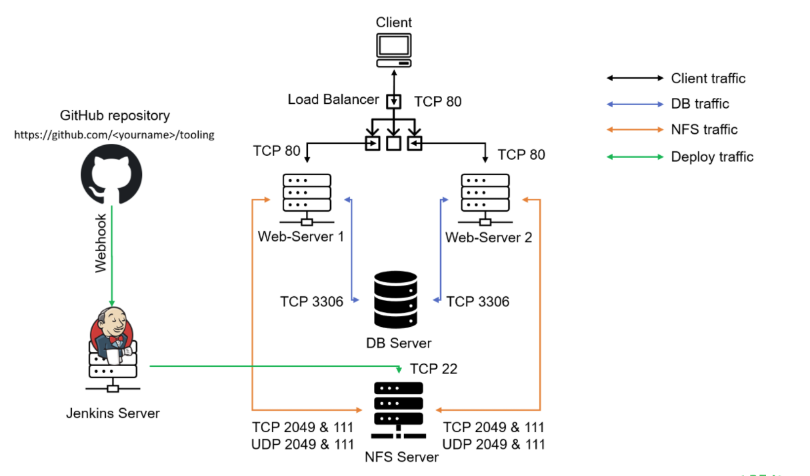

# project9
Continuous Integration Pipeline for Tooling Website

This project further builds upon Project 8 by incorporating one of the most popular CI/CD tools -Jenkins. In this project, Jenkins is used to make sure that every change made to the GitHub source code will be automatically updated to the Tooling website.

The architecture of the implementation is below:

Find the full documentation [here](https://github.com/enyioman/project9/blob/main/project9.md).
